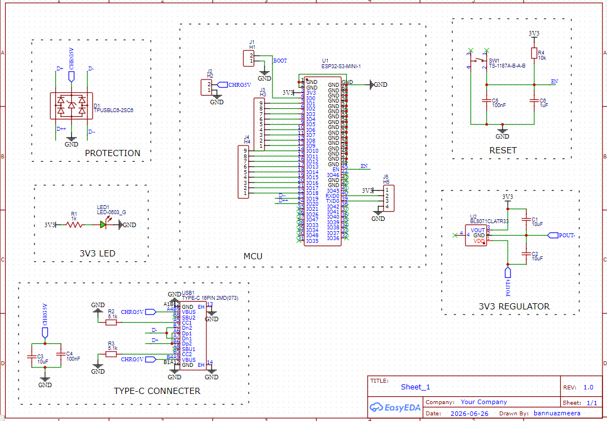
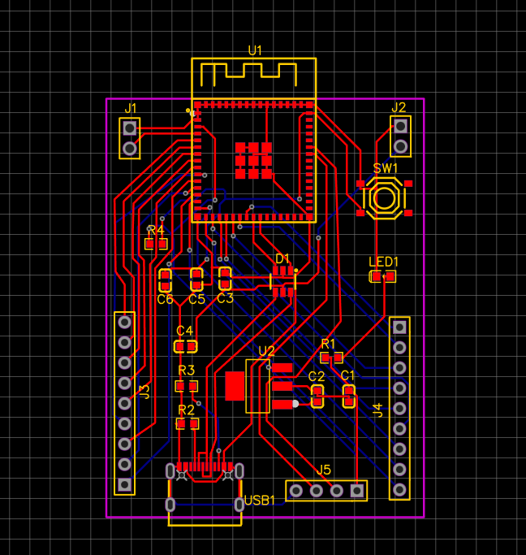
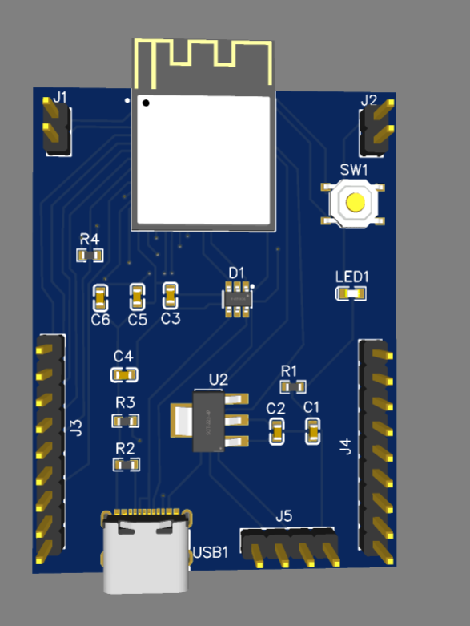
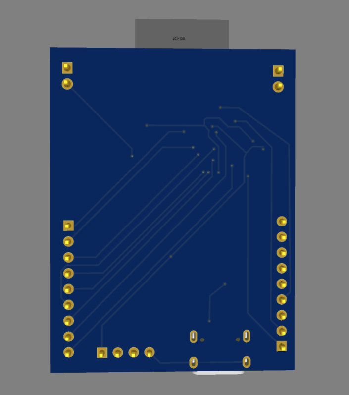

<div align="center">

# 🚀 ESP32-S3 Custom Development Board

### Professional 2-Layer ESP32-S3 PCB Designed in EasyEDA

A compact, production-ready ESP32-S3 development board featuring USB Type-C power input, 3.3V regulation, ESD protection, reset circuitry, status LED, boot header, and GPIO breakout headers.

Designed for Embedded Systems, IoT, Robotics, Automation, and PCB Design learning.

---


</div>

---

# 📷 Project Preview

## Schematic

<p align="center">

</p>

---

## PCB Layout

<p align="center">

</p>

---

## 3D Top View

<p align="center">

</p>

---

## 3D Bottom View

<p align="center">

</p>

---

# ✨ Features

- ✅ ESP32-S3 Mini-1 Module
- ✅ USB Type-C Interface
- ✅ 3.3V LDO Voltage Regulator
- ✅ USB ESD Protection
- ✅ Reset Push Button
- ✅ Power Status LED
- ✅ Boot Header
- ✅ GPIO Breakout Headers
- ✅ Compact Two-Layer PCB
- ✅ EasyEDA Design Files
- ✅ Ready for Fabrication

---

# 🔧 Hardware Components

| Component | Description |
|------------|------------|
| ESP32-S3 Mini-1 | Main MCU |
| USB Type-C | Power Input |
| BL8071 LDO | 3.3V Regulator |
| USBLC6-2SC6 | USB ESD Protection |
| Push Button | Reset |
| LED | Power Indicator |
| Capacitors | Power Filtering |
| Resistors | Pull-up & LED Current Limiting |
| Header Pins | GPIO Breakout |

---

# ⚡ Power Architecture

```
USB Type-C
      │
      ▼
ESD Protection
      │
      ▼
3.3V LDO Regulator
      │
      ▼
ESP32-S3 Module
      │
      ▼
GPIO Headers
```

---

# 📌 Applications

- IoT Devices
- Embedded Systems
- Home Automation
- Industrial Automation
- Robotics
- Wireless Sensor Nodes
- Smart Agriculture
- Wearable Electronics
- PCB Design Learning
- ESP32 Firmware Development

---

# 🛠 Software Used

- EasyEDA
- ESP-IDF
- Arduino IDE

---

# 📈 Future Improvements

- Battery Charging Circuit
- Li-ion Battery Support
- USB-UART Interface
- Power Switch
- RGB Status LED
- I2C Sensor Connector
- SPI Expansion Header
- OLED Display Connector

---

# 🤝 Contributions

Contributions, suggestions, and improvements are always welcome.

Feel free to Fork ⭐ Star ⭐ and Create Pull Requests.

---

<div align="center">

### ⭐ If you like this project, don't forget to Star the repository!

Made with ❤️ by **Bannu Azmeera**

</div>
